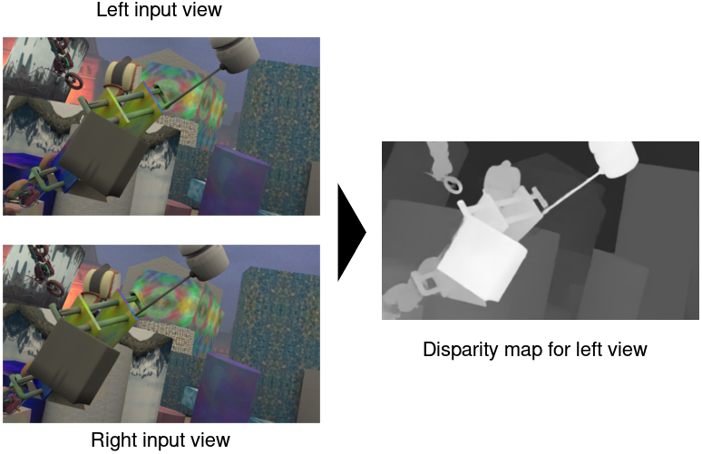

# DispNet3, FlowNet3, FlowNetH, SceneFlowNet -- in Docker

This repository contains a Dockerfile and scripts to build and run neural networks for disparity, optical flow, and scene flow estimation in Docker containers. We also provide some example data to test the networks. 

If you use this project or parts of it in your research, please cite the corresponding papers:

    @InProceedings{ICKMB18,
      author       = "E. Ilg and {\"O}. {\c{C}}i{\c{c}}ek and S. Galesso and A. Klein and O. Makansi and F. Hutter and T. Brox",
      title        = "Uncertainty Estimates and Multi-Hypotheses Networks for Optical Flow",
      booktitle    = "European Conference on Computer Vision (ECCV)",
      month        = " ",
      year         = "2018",
      note         = "https://arxiv.org/abs/1802.07095",
      url          = "http://lmb.informatik.uni-freiburg.de/Publications/2018/ICKMB18"
    }
    @InProceedings{ISKB18,
      author       = "E. Ilg and T. Saikia and M. Keuper and T. Brox",
      title        = "Occlusions, Motion and Depth Boundaries with a Generic Network for Disparity, Optical Flow or Scene Flow Estimation",
      booktitle    = "European Conference on Computer Vision (ECCV)",
      month        = " ",
      year         = "2018",
      url          = "http://lmb.informatik.uni-freiburg.de/Publications/2018/ISKB18"
    }

See the [paper](http://lmb.informatik.uni-freiburg.de/Publications/2018/ICKMB18) [websites](http://lmb.informatik.uni-freiburg.de/Publications/2018/ISKB18) and the [dataset website](https://lmb.informatik.uni-freiburg.de/resources/datasets/SceneFlowDatasets.en.html) for more details.

## 0. Requirements

We use [nvidia-docker](https://github.com/NVIDIA/nvidia-docker#quick-start) for reliable GPU support in the containers. This is an extension to Docker and can be easily installed with just two commands.
To run the networks, you need an Nvidia GPU with >1GB of memory (at least Kepler).
Since we use TensorFlow, even a small GPU can run all networks (they just run slower). All networks have been successfully run on a Nvidia GTX 970 with **4GB VRAM**, on inputs with a resolution of **960x540**.

## 1. Building the Docker image

Simply run `make`. This will create two Docker images: The OS base (an Ubuntu 18.04 base extended by Nvidia, with CUDA 10.0 and CuDNN 7.3), and the "lmb-freiburg-netdef" image on top. In total, about **17GB** of space will be needed after building. The build process will download our own TensorFlow binaries (v1.11, custom-built for Ubuntu 18.04 and CUDA 10).

## 2. Running containers

Make sure you have read/write rights for the current folder. Run the `run-network.sh` script. It will print some help text, but here are two examples to start from:

### 2.1 Disparity estimation
- let's use the *DispNet3/CSS* variant
- we assume that we are on a single-GPU system
- we want debug outputs, but not the whole network stdout (`-v`)

> $ ./run-network.sh -n DispNet3/CSS -v data/0000000-imgL.png data/0000000-imgR.png .

### 2.2 Optical flow estimation
- let's run the *FlowNet3/CSS-ft-kitti* variant (which is specialized for KITTI)
- we want to use GPU "1" on a multi-GPU system (`-g 1`)
- we want to see the full network printfest

> $ ./run-network.sh -n FlowNet3/CSS -g 1 -vv data/0000000-imgL.png data/0000001-imgL.png .

## 4. License
The files in this repository are under the [GNU General Public License v3.0](LICENSE)

