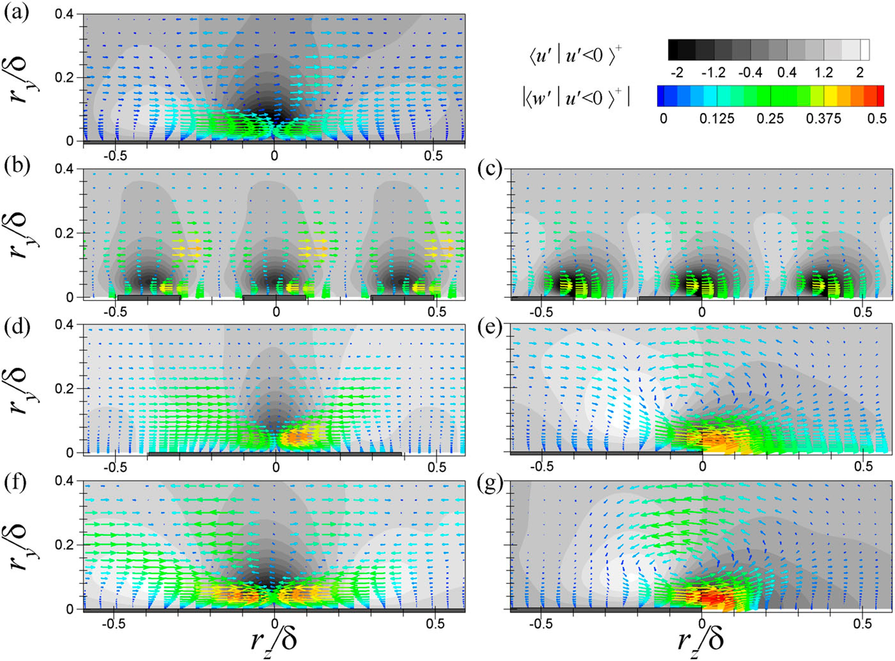

# Direct Numerical Simulation code
Comparison of superhydrophobic drag reduction between turbulent pipe and channel flows
https://doi.org/10.1063/1.5000729

## Abstract

It has been known over several decades that canonical wall-bounded internal flows of a pipe and channel share flow similarities, in particular, close to the wall due to the negligible curvature effect. In the present study, direct numerical simulations of fully developed turbulent pipe and channel flows are performed to investigate the influence of the superhydrophobic surfaces (SHSs) on the turbulence dynamics and the resultant drag reduction (DR) of the flows under similar conditions. SHSs at the wall are modeled in spanwise-alternating longitudinal regions with a boundary with no-slip and shear-free conditions, and the two parameters of the spanwise periodicity (P/δ) and SHS fraction (GF) within a pitch are considered. It is shown, in agreement with previous investigations in channels, that the turbulent drag for the pipe and channel flows over SHSs is continuously decreased with increases in P/δ and GF. However, the DR rate in the pipe flows is greater than that in the channel flows with an accompanying reduction of the Reynolds stress. The enhanced performance of the DR for the pipe flow is attributed to the increased streamwise slip and weakened Reynolds shear stress contributions. In addition, a mathematical analysis of the spanwise mean vorticity equation suggests that the presence of a strong secondary flow due to the increased spanwise slip of the pipe flows makes a greater negative contribution of advective vorticity transport than the channel flows, resulting in a higher DR value. Finally, an inspection of the origin of the mean secondary flow in turbulent flows over SHSs based on the spatial gradients of the turbulent kinetic energy demonstrates that the secondary flow is both driven and sustained by spatial gradients in the Reynolds stress components, i.e., Prandtl’s secondary flow of the second kind.

## Contact

hyungjae.lim465@gmail.com
