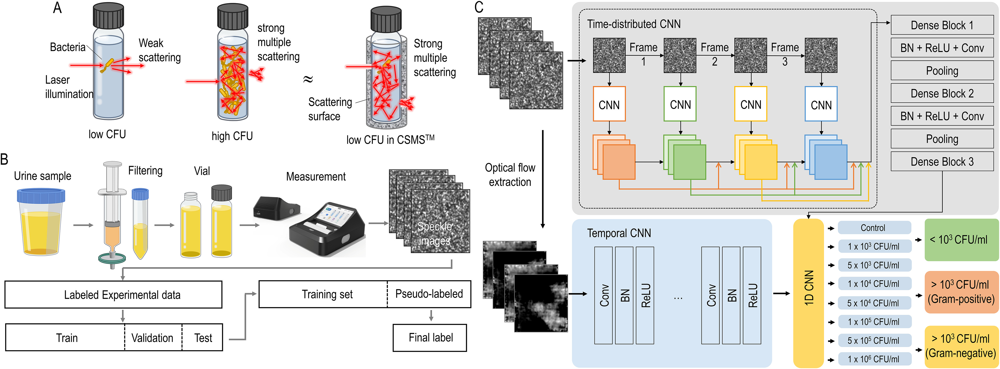
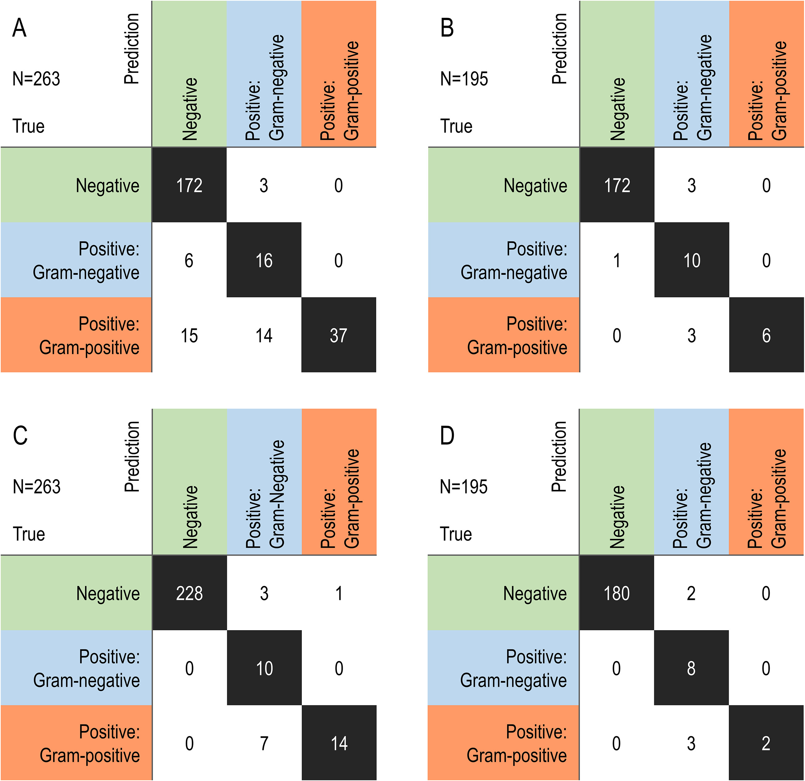

# Rapid Urinary Tract Infection

## About Project
요로감염 원인균 판단시에 24시간 이상 소요됨에 따라 그 사이 범용 항생제 오남용 처방으로 인하여 고통받는 환자분들을 위해, 요로감염 원인균을 실시간으로 분석하는 장비 개발 프로젝트를 진행하였습니다.

## Paper Abstract

Images of laser scattering patterns generated by bacteria in urine are promising resources for deep learning. However, floating bacteria in urine produce dynamic scattering patterns and require deep learning of spatial and temporal features. We hypothesized that bacteria with variable bacterial densities and different Gram staining reactions would generate different speckle images. After deep learning of speckle patterns generated by various densities of bacteria in artificial urine, we validated the model in an independent set of clinical urine samples in a tertiary hospital. Even at a low bacterial density cutoff (1,000 CFU/mL), the model achieved a predictive accuracy of 90.9% for positive urine culture. At a cutoff of 50,000 CFU/mL, it showed a better accuracy of 98.5%. The model achieved satisfactory accuracy at both cutoff levels for predicting the Gram staining reaction. Considering only 30 min of analysis, our method appears as a new screening tool for predicting the presence of bacteria before urine culture.

https://doi.org/10.1128/spectrum.01769-21

## Contact

hyungjae.lim465@gmail.com
